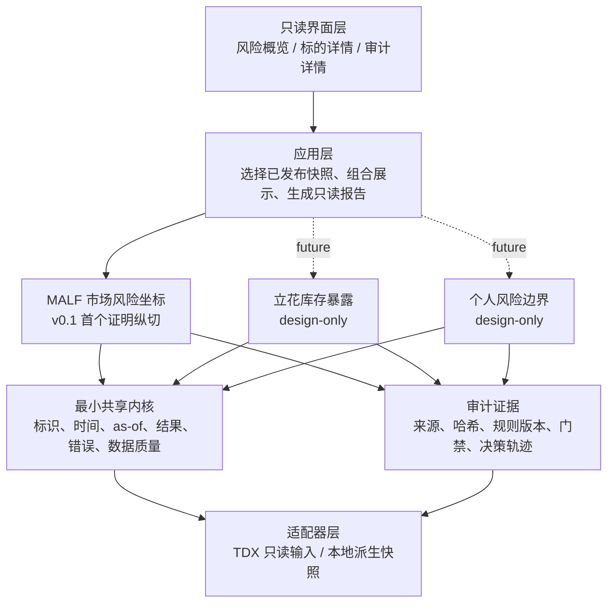
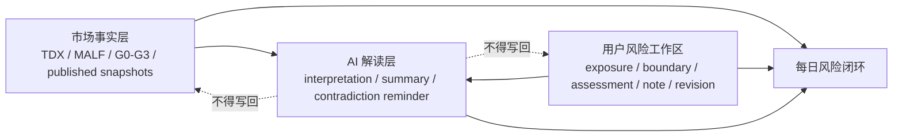

# 设计第 2 部分：领域架构与子系统边界

- 文档状态：`approved / extended-by-RB-GATE-004`
- 基线版本：`riskbench-design-v0.1 + product-realignment-v0.1`
- 批准日期：`2026-07-19`
- 上游治理：[`01-系统治理与文档权威链.md`](01-系统治理与文档权威链.md)
- 聚合总览：[`启动设计`](../superpowers/specs/2026-07-19-asteria-riskbench-bootstrap-design.md)
- 产品扩展：[`07-产品重定位与每日风险闭环.md`](07-产品重定位与每日风险闭环.md)

## 1. 目标

RiskBench 中的 MALF、立花库存和个人风险三个风险域必须独立演进，只能通过不可变快照在应用层组合，禁止互相偷偷修改状态或把一个域的结论伪装成另一个域的事实。

原 v0.1 首先证明 MALF 市场风险坐标。`RB-GATE-004` 在不降低该证明要求的前提下，批准个人风险工作区和可选 AI 解读进入产品设计；它们仍为 `not-started`，不得解释为实现授权。

## 2. 总体架构



### 2.1 层级职责

| 层 | 只负责 | 明确不负责 |
|---|---|---|
| Viewer | 读取已发布 JSON，展示状态和审计证据 | 读取 TDX、聚合、计算 MALF、补全 None |
| 应用层 | 编排用例、选择和组合不可变快照 | 定义领域规则、写回领域对象 |
| 领域层 | 各自构造本领域不可变事实 | 直接操作 UI、外部目录或其他领域内部状态 |
| 最小共享内核 | 标识、时间、as-of、错误和质量语义 | 综合评分、跨域业务判断 |
| 审计层 | 记录来源、规则版本、门禁和内容哈希 | 重新计算或修改结果 |
| 适配器层 | 读取外部输入并返回标准化不可变数据 | 定义 MALF、立花或个人风险语义 |

## 3. 领域子系统

### 3.1 MALF 市场风险坐标

职责：

- 从标准 PriceBar 构造月、周、日各自独立的 MALF 结构事实；
- 输出 `WaveProbabilitySnapshot`；
- 应用层把三个周期快照透明组合成 `MultiTimeframeRiskCoordinateSnapshot`；
- 只回答“处于什么结构、哪些字段未知、为什么未知”。

不输出：

- 27 桶；
- 综合强弱分；
- 胜率、setup、accept/reject；
- 仓位、订单、PnL 或交易建议。

### 3.2 立花库存暴露

状态：`design-only`。

未来职责：描述已有库存、标的暴露变化和约束状态。它不得反向改写 MALF，也不得自动下单。

v0.1 不创建空壳实现，不假装已经开始。

### 3.3 个人风险工作区

状态：`approved-design / not-started`。

职责：保存五只 ETF 的相对暴露声明、风险边界 policy、确定性 assessment、风险状态声明和交易员笔记。它不得接入券商账户，不记录数量、成本、成交、市场价值或 PnL，也不得用用户声明修改市场事实。

### 3.4 AI 解读

状态：`approved-design / optional / not-started`。

只允许消费已发布市场事实、用户声明和确定性 assessment。AI 只能解释、总结和提醒矛盾；不得计算风险、绕过门禁、写回前两层、扩大数据权限或替代硬风险边界。移除 AI 不得影响确定性闭环。

## 4. 最小共享内核

允许共享的语义必须保持最小：

- `symbol` 和 instrument identity；
- `evaluation_date` / `as_of_date`；
- `price_line` / `price_scale`；
- 不可变结果容器；
- `reason_codes`、warnings 和 gate status；
- source identity / SHA-256；
- 规则版本；
- usage 与 freshness；
- 规范化序列化和内容哈希。

禁止建立“万能共享模型”容纳各领域全部字段。领域专属状态必须留在领域内。

## 5. 允许的数据流

```text
TDX vipdoc（只读权威输入）
→ TDX adapter
→ 标准 ETF PriceBar（不可变、raw_none、原始整数）
→ 日/周/月聚合
→ 每周期独立 MALF 构造
→ 每周期 WaveProbabilitySnapshot
→ 应用层透明组合
→ G0–G3 审计与发布快照
→ 本地只读 Viewer
```

约束：

- 适配器返回标准化不可变数据；
- 领域层返回不可变领域快照；
- 应用层只组合，不重算；
- UI 只读最终已发布结果；
- 审计记录来源、规则和降级原因；
- 任一层不得从下游文案反推或修改上游事实。

## 6. 首个最小纵切

首批标的：

- `510300`；
- `510500`；
- `159915`；
- `512880`；
- `513100`。

首个纵切只证明：

1. 只读解析 TDX `.day`；
2. 标准化 ETF `raw_none` PriceBar；
3. 日、周、月一致整数价格域聚合；
4. MALF Core + Range 的最小语义链路；
5. G0–G3、不可变快照、确定性发布；
6. 本地只读 Viewer；
7. 显式失败、降级和回退。

Lifespan/Probability 字段在资格不足时保持 `None + reason_codes`，不得为了“页面完整”而补默认值。

## 7. 外部与历史系统隔离

- 七个参考目录全部只读；
- 禁止复制旧项目结构或迁移旧代码；
- 禁止 RiskBench 运行时 import、软链接或依赖旧仓库模块；
- 历史实现只能用于差分、失败经验和人工核验；
- Definitive 与历史实现冲突时以 Definitive 为准；
- 外部机器路径不得泄露到浏览器 localStorage。

## 8. 领域组合规则

应用层组合必须满足：

- 三个周期共享同一 `symbol`；
- 每个周期保留自己的 `as_of_date`、规则版本、数据新鲜度和 completeness；
- 组合层不得发明跨周期 bucket；
- 组合层不得把一个周期字段 fallback 到另一个周期；
- 组合结果不得隐藏某周期失败或 None；
- 任何跨域组合都必须保留原始子快照身份和内容哈希。

## 9. 当前能力状态

| 能力 | 状态 |
|---|---|
| 治理与正式设计 | `approved / design-only` |
| TDX adapter | `not-started` |
| 日/周/月聚合 | `not-started` |
| MALF Core/Range | `not-started` |
| Lifespan/Probability | `not-started / not_verified` |
| G0–G3 | `not-started` |
| Viewer | `not-started` |
| 立花 | `design-only` |
| 个人风险工作区 | `approved-design / not-started` |
| AI 解读 | `approved-design / optional / not-started` |

## 10. 本分册验收条件

- 每个层级的职责与禁止事项明确；
- MALF、立花、个人风险没有共享可变状态；
- Viewer、应用层和领域层没有职责倒置；
- 首个纵切边界明确，不把未来系统伪装成 v0.1 已实现；
- 市场事实数据流只能从只读输入走向不可变快照和只读 Viewer；用户工作区写入走独立 `state/` 边界；
- 所有未来能力使用显式状态词汇。

## 11. `RB-GATE-004` 三层权威扩展

本节由 `RB-GATE-004` 批准，对本分册中“整个工作站只读”“个人风险仅为未来概念”“AI 仅为未启动占位”的冲突表述作显式扩展。未冲突的 MALF、领域隔离、共享内核和外部只读约束继续有效。



### 11.1 市场事实层

- 延续原 Data → MALF → G0–G3 → immutable snapshot 链路；
- `var/` 只保存可重建市场派生数据；
- Viewer 仍只读已发布快照，不读取 TDX、不重算 MALF；
- usage、freshness、reason_codes 和 lineage 不得被用户或 AI 改写。

### 11.2 用户风险工作区

- 保存 `ExposureDeclaration`、`RiskBoundaryPolicy`、`RiskBoundaryAssessment`、`RiskStateDeclaration` 和 `TraderNote`；
- 相对暴露使用整数 bps，五只 ETF 总和不超过 `10000`，现金由确定性公式计算；
- 无声明为 `unknown`，不得自动解释为零仓位、`neutral` 或安全；
- 用户修改只追加新的不可变 revision；
- 用户资产进入 `state/`，不得被 `var/` 清理或发布回退触碰。

### 11.3 AI 解读层

- `AIInterpretation` 必须显式标记为 AI 解读；
- 只消费前两层的已存事实与声明；
- 不计算 MALF、风险边界或边界距离；
- 不产生买卖、仓位、订单或自动交易动作；
- 超时、失败或完全移除时，市场事实和用户工作区仍可独立工作。

### 11.4 组合纪律

- `市场事实 != 用户声明 != AI 解读`；
- `unknown != neutral`；
- `风险边界内 != 安全`；
- `风险边界内 != 建议持有`；
- 产品界面可以在一个每日闭环中并置三层，但必须保留来源、时间、revision 和视觉标识；
- SQLite、Web 框架、AI Provider 等具体技术必须由 `RB-TECH-002` 决定。

## 12. 扩展后的能力状态

| 子系统 | 当前状态 | 当前授权 |
|---|---|---|
| 市场事实 / MALF | `approved-design / not-started` | 保留全部 Data/MALF/TDD 门禁 |
| 个人风险工作区 | `approved-design / not-started` | 只批准合同，不批准实现 |
| AI 解读 | `approved-design / optional / not-started` | 只批准权限边界，不批准 Provider |
| 立花库存 | `design-only` | 不进入 v0.1 实现 |
| 远程部署 | `forbidden-in-v0.1` | 必须未来专项审批 |

下一门禁为 `RB-TECH-002 / waiting-for-technology-selection-approval`。
