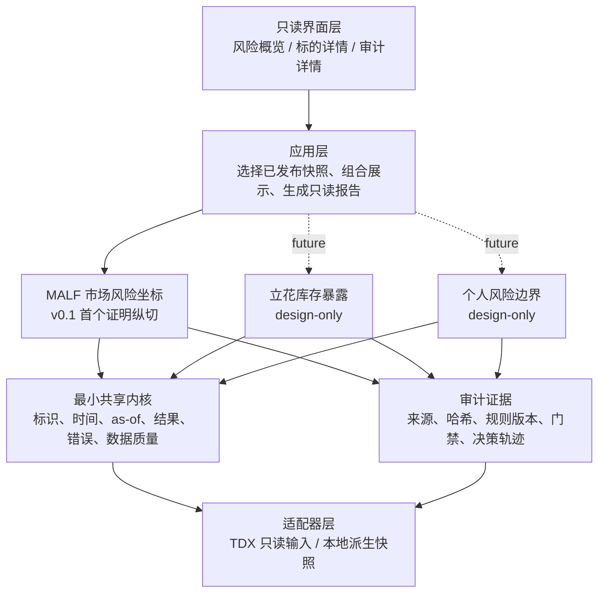

# 设计第 2 部分：领域架构与子系统边界

- 文档状态：`approved / design-only`
- 基线版本：`riskbench-design-v0.1`
- 批准日期：`2026-07-19`
- 上游治理：[`01-系统治理与文档权威链.md`](01-系统治理与文档权威链.md)
- 聚合总览：[`启动设计`](../superpowers/specs/2026-07-19-asteria-riskbench-bootstrap-design.md)

## 1. 目标

RiskBench 中的 MALF、立花库存和个人风险三个风险域必须独立演进，只能通过不可变快照在应用层组合，禁止互相偷偷修改状态或把一个域的结论伪装成另一个域的事实。

v0.1 首先证明 MALF 市场风险坐标；立花和个人风险保持 `design-only`，AI Observer 保持 `not-started`。

## 2. 总体架构



### 2.1 层级职责

| 层 | 只负责 | 明确不负责 |
|---|---|---|
| Viewer | 读取已发布 JSON，展示状态和审计证据 | 读取 TDX、聚合、计算 MALF、补全 None |
| 应用层 | 编排用例、选择和组合不可变快照 | 定义领域规则、写回领域对象 |
| 领域层 | 各自构造本领域不可变事实 | 直接操作 UI、外部目录或其他领域内部状态 |
| 最小共享内核 | 标识、时间、as-of、错误和质量语义 | 综合评分、跨域业务判断 |
| 审计层 | 记录来源、规则版本、门禁和内容哈希 | 重新计算或修改结果 |
| 适配器层 | 读取外部输入并返回标准化不可变数据 | 定义 MALF、立花或个人风险语义 |

## 3. 领域子系统

### 3.1 MALF 市场风险坐标

职责：

- 从标准 PriceBar 构造月、周、日各自独立的 MALF 结构事实；
- 输出 `WaveProbabilitySnapshot`；
- 应用层把三个周期快照透明组合成 `MultiTimeframeRiskCoordinateSnapshot`；
- 只回答“处于什么结构、哪些字段未知、为什么未知”。

不输出：

- 27 桶；
- 综合强弱分；
- 胜率、setup、accept/reject；
- 仓位、订单、PnL 或交易建议。

### 3.2 立花库存暴露

状态：`design-only`。

未来职责：描述已有库存、标的暴露变化和约束状态。它不得反向改写 MALF，也不得自动下单。

v0.1 不创建空壳实现，不假装已经开始。

### 3.3 个人风险边界

状态：`design-only`。

未来职责：描述集中度、损失容忍、暂停和恢复边界。它不得成为生产仓位公式，也不得用账户结论修改市场结构事实。

### 3.4 AI Observer

状态：`not-started`。

未来只允许消费已发布、带权限边界的只读快照。AI 不得绕过门禁、写回领域结果、扩大数据权限或替代硬风险边界。

## 4. 最小共享内核

允许共享的语义必须保持最小：

- `symbol` 和 instrument identity；
- `evaluation_date` / `as_of_date`；
- `price_line` / `price_scale`；
- 不可变结果容器；
- `reason_codes`、warnings 和 gate status；
- source identity / SHA-256；
- 规则版本；
- usage 与 freshness；
- 规范化序列化和内容哈希。

禁止建立“万能共享模型”容纳各领域全部字段。领域专属状态必须留在领域内。

## 5. 允许的数据流

```text
TDX vipdoc（只读权威输入）
→ TDX adapter
→ 标准 ETF PriceBar（不可变、raw_none、原始整数）
→ 日/周/月聚合
→ 每周期独立 MALF 构造
→ 每周期 WaveProbabilitySnapshot
→ 应用层透明组合
→ G0–G3 审计与发布快照
→ 本地只读 Viewer
```

约束：

- 适配器返回标准化不可变数据；
- 领域层返回不可变领域快照；
- 应用层只组合，不重算；
- UI 只读最终已发布结果；
- 审计记录来源、规则和降级原因；
- 任一层不得从下游文案反推或修改上游事实。

## 6. 首个最小纵切

首批标的：

- `510300`；
- `510500`；
- `159915`；
- `512880`；
- `513100`。

首个纵切只证明：

1. 只读解析 TDX `.day`；
2. 标准化 ETF `raw_none` PriceBar；
3. 日、周、月一致整数价格域聚合；
4. MALF Core + Range 的最小语义链路；
5. G0–G3、不可变快照、确定性发布；
6. 本地只读 Viewer；
7. 显式失败、降级和回退。

Lifespan/Probability 字段在资格不足时保持 `None + reason_codes`，不得为了“页面完整”而补默认值。

## 7. 外部与历史系统隔离

- 七个参考目录全部只读；
- 禁止复制旧项目结构或迁移旧代码；
- 禁止 RiskBench 运行时 import、软链接或依赖旧仓库模块；
- 历史实现只能用于差分、失败经验和人工核验；
- Definitive 与历史实现冲突时以 Definitive 为准；
- 外部机器路径不得泄露到浏览器 localStorage。

## 8. 领域组合规则

应用层组合必须满足：

- 三个周期共享同一 `symbol`；
- 每个周期保留自己的 `as_of_date`、规则版本、数据新鲜度和 completeness；
- 组合层不得发明跨周期 bucket；
- 组合层不得把一个周期字段 fallback 到另一个周期；
- 组合结果不得隐藏某周期失败或 None；
- 任何跨域组合都必须保留原始子快照身份和内容哈希。

## 9. 当前能力状态

| 能力 | 状态 |
|---|---|
| 治理与正式设计 | `approved / design-only` |
| TDX adapter | `not-started` |
| 日/周/月聚合 | `not-started` |
| MALF Core/Range | `not-started` |
| Lifespan/Probability | `not-started / not_verified` |
| G0–G3 | `not-started` |
| Viewer | `not-started` |
| 立花 | `design-only` |
| 个人风险 | `design-only` |
| AI Observer | `not-started` |

## 10. 本分册验收条件

- 每个层级的职责与禁止事项明确；
- MALF、立花、个人风险没有共享可变状态；
- Viewer、应用层和领域层没有职责倒置；
- 首个纵切边界明确，不把未来系统伪装成 v0.1 已实现；
- 数据流只能从只读输入走向不可变快照和只读展示；
- 所有未来能力使用显式状态词汇。
