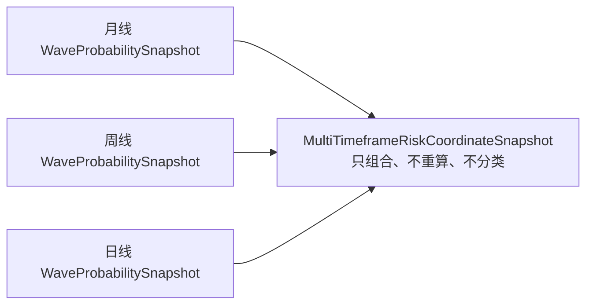

# 设计第 3 部分：MALF v2.0 透明多周期坐标

- 文档状态：`approved / design-only`
- 基线版本：`riskbench-design-v0.1`
- MALF adapter 版本：`malf-v2.0-etf-tick-v0.1`
- 批准日期：`2026-07-19`
- 精度合同澄清：`2026-07-20 / RB-CLARIFY-001`
- 权威登记：[`02-权威来源登记.md`](../02-权威来源登记.md)
- 上游架构：[`02-领域架构与子系统边界.md`](02-领域架构与子系统边界.md)

## 1. 权威定位

MALF 正式全称：**Market Analysis Logical Framework**。

RiskBench 不复制、不改写 MALF Definitive v2.0。语义权威目录为：

`J:\asteria-trading-labs-Definitive-validated\MALF_Definitive_v2_0-claude-20260616`

必须按 `MALF_00_Bridge → 01_Core → 02_Range → 03_Lifespan → 04_Probability → 05_Service` 的顺序理解。

正式链路：

```text
PriceBar
→ Core
→ Range
→ Lifespan
→ Probability
→ WaveProbabilitySnapshot
```

`WaveProbabilitySnapshot` 虽以 Wave 命名，正式语义包含 Wave、Range、Lifespan/Probability 的可用结果；字段资格不足时必须保持 None。

## 2. 永久撤回 27 桶

旧草案：

```text
月牛熊盘 × 周顺逆盘 × 日新高新低盘 = 27 桶
```

已永久撤回，不属于 MALF 正式模型，原因包括：

- 把独立周期压缩成预设组合；
- 发明不在 Definitive 中的 bucket 语义；
- 容易被误解为评分、胜率或交易信号；
- 掩盖单周期数据不足和字段未形成；
- 破坏透明性和可审计性。

正式替代方案是三周期不可变快照透明组合。

## 3. 三周期透明组合



月、周、日分别：

- 使用各自聚合后的 PriceBar 序列；
- 独立执行相同版本的 MALF；
- 保留各自 `as_of_date`；
- 保留各自 completeness、usage、reason_codes 和规则版本；
- 同一 evaluation context 下组合发布；
- 不互相 fallback，不跨周期补值。

## 4. 单周期 `WaveProbabilitySnapshot` 最小合同

单周期快照至少包含：

- `symbol`；
- `timeframe`；
- `as_of_date`；
- `data_freshness`；
- `usage`；
- `price_line`；
- `price_scale`；
- `rule_versions`；
- `source_hashes`；
- `core`；
- `range`；
- `lifespan`；
- `probability`；
- `snapshot_completeness`；
- `reason_codes`；
- `warnings`；
- `content_hash`。

尚未形成或资格不足的字段为 `None + reason_codes`，不得写成 neutral、flat、balanced 或其他默认结论。

## 5. 多周期组合快照最小合同

`MultiTimeframeRiskCoordinateSnapshot` 至少包含：

- `symbol`；
- `evaluation_date`；
- `profile_id`；
- `month_snapshot`；
- `week_snapshot`；
- `day_snapshot`；
- `coordinate_completeness`；
- `usage`；
- `freshness`；
- `rule_versions`；
- `source_hashes`；
- `reason_codes`；
- `content_hash`。

组合层不得新增：

- bucket_id；
- 27 桶标签；
- 综合强弱分；
- 胜率；
- accept/reject；
- setup；
- 仓位、订单或 PnL。

## 6. ETF fixed-point adapter

当前 profile：`etf_raw_research_v0.1`。

当前数据合同：

- `price_line=raw_none`；
- TDX 来源价格使用原始整数；
- `price_scale=1000`；
- `/1000` 只用于展示；
- Pivot、Guard、Break 和边界判断只使用严格 `<` 与 `>`；
- 相等不触发新 pivot、break 或突破；
- 禁止 binary float；
- 禁止临时 `round(2)`；
- 日、周、月聚合全程保持相同整数价格域。

### 6.1 精度合同澄清：不是交易所 tick-size 对齐

当前 `raw_none` profile 的比较域正式命名为：

```text
source_integer_fixed_point
```

其含义是：使用 TDX 来源字段本身的整数域作结构比较，`price_scale=1000` 只负责解释和展示该整数域。它**不**要求在 v0.1：

- 读取、保存或校验交易所 `tick_size`；
- 将价格量化为交易所 tick 的倍数；
- 推断“来源整数必然等同于任一证券的交易所最小报价单位”。

因此 `malf-v2.0-etf-tick-v0.1` 中的 `tick` 只标识该 ETF fixed-point adapter/profile；正式可审计的比较合同是 `source_integer_fixed_point`，而不是未定义的 exchange `tick_size` 合同。

### 6.2 与 MALF Definitive 的关系

MALF Definitive Core 的 O3 规定先按 `round(2)` 归一化精度。当前 adapter 刻意保留 TDX 三位来源整数，避免将 `1.123` 与 `1.124` 压缩为同一比较值；两种归一化策略在部分输入上可能产生不同结构结果。

所以该 adapter：

- 不修改、不覆盖 Definitive 原文；
- 是 `raw_none / research_only` 范围内的 RiskBench adapter variant；
- **不得宣称为 Definitive `round(2)` 精度策略的等价实现或已验证替代**；
- 必须在 `rule_versions` 中同时记录 `malf-v2.0-etf-tick-v0.1` 与 `source_integer_fixed_point-v0.1`；
- 只要这两个版本任一缺失，结果不能作为已发布快照。

示例：

```text
来源整数 1123
展示价格 1.123
结构比较仍使用 1123
```

若先 `round(2)`，`1.123` 和 `1.124` 可能都被压缩为 `1.12`，改变真实顺序，因此禁止。

## 7. `raw_none` 与 `qfq_back` 边界

MALF Definitive 的目标调用合同要求 `qfq_back`。RiskBench v0.1 当前只用 `raw_none` 证明：

- 数据解析；
- 周/月聚合；
- Core/Range 状态机；
- fixed-point adapter；
- 门禁、审计、发布和 Viewer 链路。

因此当前真实数据只能标记 `research_only`，不得冒充满足 Definitive 的生产价格线资格。

未来 `qfq_back` 必须：

1. 定义调整后价格的固定精度合同；
2. 建立独立 fixture；
3. 建立独立规则版本；
4. 验证 corporate action 调整和防前视；
5. 经过独立设计和门禁批准。

`raw_none` adapter 测试通过不代表 `qfq_back` 已验证。

`qfq_back` 不自动继承 `source_integer_fixed_point-v0.1`，也不得反向使用 `raw_none` 的结论证明其精度等价性。

## 8. Core、Range、Lifespan 与 Probability 完整性

### 8.1 Core

必须遵循 Definitive 的 pivot、wave、guard 和 break 语义，包括：

- fractal `k=2`；
- 相等不触发；
- 初始化历史不足保持 uninitialized；
- Guard 相等不 break；
- terminated wave 不复活；
- latest candidate replacement；
- New Wave 双条件。

### 8.2 Range

Range 是一等公民，不是默认 transition 标签。必须保留边界、持续时间、突破方向和 resolution；历史不足或未形成时为 None。

### 8.3 Lifespan

Wave 和 Range 采用双轨样本，不得混用。缺少同类历史样本时 rank 为 None。

### 8.4 Probability

Probability 只在样本资格、防前视和 P1–P4 条件满足后生成。peer sample 少于 30 时，相关 rank/Probability 字段为 None，严禁 fallback。

RiskBench 当前状态：`not-started / not_verified`。

## 9. 首批研究标的和事实边界

首批标的：`510300`、`510500`、`159915`、`512880`、`513100`。

当前登记事实：

- 五只 ETF 最后数据日均为 `2026-06-29`；
- evaluation date 为 `2026-07-19`；
- `price_line=raw_none`；
- 因此用途只能是 `research_only / stale_research_only`。

页面和报告必须同时显示绝对数据日期、评估日期、price_line、price_scale、usage 和缺失字段原因。

## 10. 错误与降级状态

稳定状态至少包括：

- `fresh`；
- `stale_research_only`；
- `freshness_unknown`；
- `invalid_rejected`；
- `unsupported_price_line`；
- `insufficient_history`；
- `uninitialized`；
- `insufficient_peer_sample`；
- `probability_not_verified`。

所有失败字段必须是 `None + reason_codes`，不得吞错、默认 neutral 或跨周期 fallback。

## 11. 本分册验收条件

- 27 桶已从正式模型永久撤回；
- 月/周/日分别输出不可变 MALF 快照；
- 组合层只组合，不重算、不分类；
- ETF 结构比较全程使用原始整数和严格不等式；
- `raw_none` 不冒充 `qfq_back`；
- 数据不足和样本不足产生 None 与稳定原因码；
- Probability 在资格满足前保持未验证；
- 页面和审计快照保留完整日期、来源、规则和降级信息。

## 12. 修订记录

| 日期 | 记录 | 说明 |
|---|---|---|
| 2026-07-19 | 初始批准 | 建立 `raw_none` 原始整数 fixed-point adapter。 |
| 2026-07-20 | `RB-CLARIFY-001` | 明确比较域、非 exchange tick-size 范围、与 Definitive `round(2)` 的非等价性及 `qfq_back` 隔离。 |
