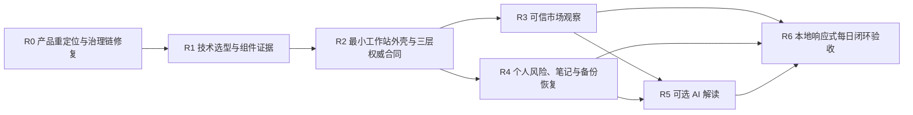

# RiskBench v0.1 实施路线图

- Roadmap 版本：`riskbench-roadmap-v0.2`
- 文档状态：`approved-product-roadmap / implementation-not-started`
- 批准门禁：`RB-GATE-004 / approved`
- 批准日期：`2026-07-20`
- 上游设计：设计 01–07
- 当前里程碑：`R1 / waiting-for-technology-selection-approval`
- 当前下一门禁：`RB-TECH-002`

> 本 Roadmap 以“风险管理为主、AI 为辅、只开发核心闭环、成熟免费开源组件优先、每日场景驱动”为主线。
>
> 本 Roadmap 不等于业务实施授权。每个里程碑必须满足入口条件；任务必须有稳定 ID、实现计划、TDD 和施工记录；触碰红线必须重新审批。

## 1. Supersedes 声明

`riskbench-roadmap-v0.2` supersedes `riskbench-roadmap-v0.1-draft.1` 的后续执行安排。

保留历史事实：

- `RB-GATE-003` 曾批准旧 Roadmap；
- 旧 Roadmap 的六个里程碑、21 个任务和 `RB-M01-T01` 草案保留在 Git 历史和施工账本；
- `RB-M01-T01` 未实施、未完成，状态为 `suspended-by-RB-GATE-004`；
- 不复用旧任务 ID，不把暂停伪装成完成。

## 2. 总体依赖



AI 是可选支线：R5 未启用或失败时，R3 + R4 的确定性闭环仍必须可用。R6 可以验证“AI 禁用”的完整闭环。

## 3. 里程碑总表

| 里程碑 | 目标 | 当前状态 | 入口／出口门禁 |
|---|---|---|---|
| `R0` | 产品重定位、设计 07、治理链、supersedes | `completed-by-RB-GATE-004` | 出口：文档发布且远端一致 |
| `R1` | 技术选型、许可证、组件工厂证据和装配边界 | `waiting-for-technology-selection-approval` | `RB-TECH-002` |
| `R2` | 工作站外壳、三层权威合同、`var/`/`state/` 分界 | `not-started` | R1 selected stack；独立里程碑批准 |
| `R3` | TDX→G0–G3→月周日 MALF→快照→只读 Viewer | `not-started` | R2；设计 03/04/06 正确性门禁 |
| `R4` | 相对暴露、确定性边界、风险笔记、revision、备份／恢复 | `not-started` | R2；用户资产安全验收 |
| `R5` | 可选 AI 解释、总结和矛盾提醒 | `not-started` | R3 + R4；AI 权限门禁 |
| `R6` | 同机桌面／平板／手机 viewport 每日闭环验收 | `not-started` | R3 + R4；R5 可选 |

## 4. R0——产品重定位与治理链修复

交付：设计 07、三层权威、统一术语表、`var/`/`state/` 分界、单写入合同、新 Roadmap、Workflow v0.2、旧 Roadmap superseded、`RB-M01-T01` 暂停、当前门禁统一为 `RB-TECH-002`。

出口：正式索引、批准记录、设计、Roadmap、Workflow、施工账本一致并推送 `origin/main`。

## 5. R1——技术选型与组件证据

目标：明确“选什么、不选什么、为什么、何时进入主系统”。

必须审核：

- 运行时与标准库边界；
- 边界 schema／validation；
- 本地 HTTP Viewer；
- 原生前端与图表候选；
- TDD 与浏览器验收工具；
- 包管理与可重建安装；
- 用户状态持久化、事务、锁、迁移、备份和恢复；
- 许可证、维护性、离线能力、安全边界和回滚。

状态必须使用：

```text
candidate
trial-running
trial-passed
recommended-for-selection
selected
deferred
rejected
```

`trial-passed != selected`。出口门禁为 `RB-TECH-002`；该门禁只选定可进入任务计划的技术，不自动安装依赖或创建骨架。

## 6. R2——最小工作站外壳与三层权威合同

最低成果：

- 市场快照读取边界；
- 用户工作区写入边界；
- AI 解读边界；
- `var/` 与 `state/` 分区和 Git 忽略；
- 单写入 OS 锁；
- append-only revision 和事务失败行为；
- 统一 reason codes、类型和审计身份；
- 显式刷新命令，不引入 scheduler/watcher。

不得在 R2 顺手实现完整 Data/MALF、交易功能或远程部署。

## 7. R3——可信市场观察

保持设计 03、04、05、06 的硬要求：

- TDX `.day` 只读解析；
- 日／周／月整数域聚合；
- MALF Core/Range 最小纵切；
- field-level `None + reason_codes`；
- G0–G3；
- 不可变发布、原子 `current.json`、显式回退；
- Viewer 只读已发布快照，GET/HEAD-only，绑定 `127.0.0.1`；
- 真实数据只能 `research_only`。

## 8. R4——个人风险、笔记与备份恢复

最低成果：

- 五只 ETF 的整数 bps 相对暴露；
- 总暴露不超过 10000、现金确定性计算；
- `as_of` 和 unknown 语义；
- `RiskBoundaryPolicy` 与确定性 `RiskBoundaryAssessment`；
- `RiskStateDeclaration`、`TraderNote`；
- 追加式不可变 revision；
- 本地备份、恢复、损坏停写和破坏性迁移前备份。

不记录券商账户、数量、成本、成交、市场价值或 PnL；不实现通用迁移包。

## 9. R5——可选 AI 解读

最低成果：

- AI 仅消费已授权的市场事实、用户声明和确定性 assessment；
- 输出独立 `AIInterpretation`；
- 明确 fact / interpretation / hypothesis；
- 不修改 MALF、门禁、边界或声明；
- 禁用、超时、失败时确定性闭环继续可用；
- 不提供交易建议或自动行动。

AI Provider 和协议必须引用 `RB-TECH-002` 的 selected 结果；未选定不得接入。

## 10. R6——本地响应式每日闭环验收

R6 只允许：

- 浏览器设备模拟；
- Playwright 或获批等价工具的 viewport；
- 同机浏览器窗口尺寸调整；
- `responsive-layout-test`；
- `same-machine-browser-test`。

R6 明确禁止：

- `physical-device-network-access`；
- LAN binding；
- `0.0.0.0`、局域网 IP 或公网地址；
- 隧道、公网、小主机或云端部署。

“手机／平板／桌面验收”只代表响应式布局，不代表手机或平板从另一台物理设备访问。Viewer 继续只绑定 `127.0.0.1`。

验收至少覆盖：

- 数据日期、freshness、usage 和 `research_only` 可见；
- 月／周／日 MALF 事实与未知原因可见；
- 相对暴露、现金、边界与距离可见且确定性一致；
- 笔记和 revision 可追踪；
- AI 输出明确标注且可禁用；
- 备份／恢复证据；
- `var/` 清理不影响 `state/`；
- 多 viewport 不突破网络绑定红线。

## 11. 里程碑治理

```text
里程碑批准
＋任务计划留痕
＋逐步施工记录
＋TDD
＋触碰红线立即暂停
```

- 里程碑未批准，不得创建其业务实现；
- 已批准里程碑内的普通任务必须有稳定 ID、范围、计划、测试和回滚，但不默认要求用户逐任务点击批准；
- 里程碑门禁、特殊门禁或红线变更仍必须由用户明确批准；
- 任务完成不等于里程碑完成，里程碑出口必须整体复核。

## 12. 必须重新审批的变化

- 修改 MALF 或 fixed-point 精度合同；
- 新增数据源或价格线；
- 扩大 AI 权限；
- 引入账户、订单、PnL 或自动交易；
- 改为局域网、公网、隧道、小主机或云部署；
- 引入未经批准的依赖；
- 扩大已批准里程碑范围。

## 13. 当前下一门禁

> **`RB-TECH-002 / waiting-for-technology-selection-approval`：审核候选技术栈、组件台账、许可证和实验工厂证据。批准后仅允许 selected 组件进入后续里程碑任务计划，不等于安装依赖或开始实现。**
